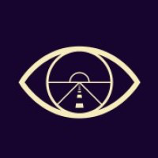

# Perspective
> Perspective is a smart mirror using augmented reality to prevent cancer through behavioral change

## Setup
The project is built upon MediaPipe which depends on Bazelisk, OpenCV and FFmpeg. 
Please see the [MediaPipe installation instructions](https://google.github.io/mediapipe/getting_started/install.html) to install and prepare these dependencies.

For setup on a Jetson Nano, first run `./linux_setup.sh` which installs various dependencies and applies fixes in order to prepare the system for building.

Finally run `make run` in the `mediapipe` directory.

## Project Structure
```C
linux_setup.sh // Jetson Nano setup script
mediapipe/
├── makefile   // makefile that enables `make perspective` and `make run`
├── mediapipe/
│   ├── perspective/ // Source code for main executable
│   │   ├── BUILD // bazel build file
│   │   ├── data/ // face filters
│   │   │   ├── filter1.png
│   │   │   ├── filter2.png
│   │   │   ├── ...
│   │   │   └── filter9.png
│   │   ├── perspective.cc // main C++ file
│   │   ├── perspective_graph_gpu.pbtxt // main MediaPipe graph
│   │   └── face_effect_gpu.pbtxt
sensor-test/  // scripts to test connection to Arduino
camera-test/  // scripts to test camera input
```

## License
MediaPipe is licensed under the Apache License 2.0.

All original files in this repository are licensed under the MIT license.
